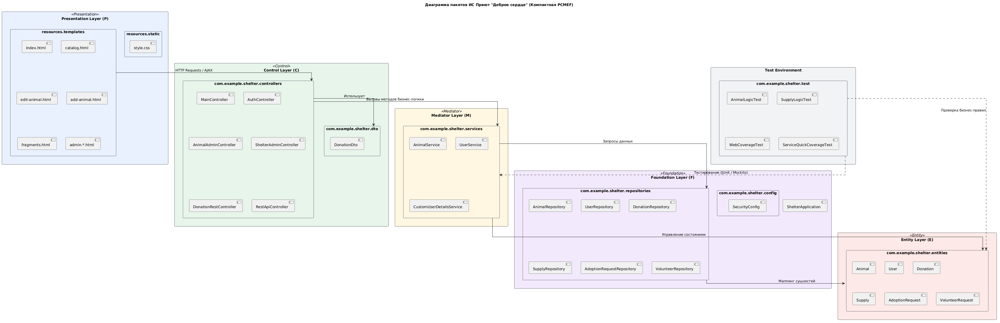

# Информационная система приюта «Доброе сердце»

**Автор:** Алдабаева Виктория Владимировна 
**Группа:** ПИЖ-б-о-23-1-(1)
**Траектория:** Web (Enterprise Java)  
**Дата начала:** 01.03.2026  
**Дата сдачи:** 30.06.2026


## Описание проекта

Информационная система приюта «Доброе сердце» — это веб-платформа для автоматизации учета питомцев, контроля складских запасов (кормов и медикаментов) и обработки заявок на адопцию. Система предназначена для оптимизации работы волонтеров и администраторов приюта.

## Траектория выполнения

- [x] **Веб-разработка** (Spring Boot + Thymeleaf)
- [ ] Десктоп
- [ ] Мобильная
- [ ] Enterprise


## Технологический стек

| Компонент             | Технология                                     |
| :-------------------- | :--------------------------------------------- |
| **Бэкенд**            | Java 17, Spring Boot 3, PostgreSQL             |
| **Представление**     | Thymeleaf, Bootstrap 5, JavaScript (Fetch API) |
| **API**               | REST, OpenAPI 3.0 (Swagger)                    |
| **Сервер приложений** | Apache Tomcat 10.x                             |
| **Сборка**            | Maven                                          |
| **Инструменты**       | Git, Postman, JaCoCo                           |

##  Требования к окружению

| Требование           | Версия |
|----------------------|--------|
| Java JDK             |   17+  |
| Node.js              |   18+  |
| PostgreSQL           |   15+  |
| Maven                |   3.8+ |
| Apache Tomcat        |   10+  |


## Установка и запуск

### 1. Клонирование репозитория


```bash
git clone https://github.com/Pharrower/Aldabaeva_Web-development_2026
cd course-project

```

### 2. Сборка проекта

```bash
mvn clean package
```

### 3. Деплой на Tomcat

1. После успешной сборки файл shelter.war появится в директории target/.

2. Скопируйте его в папку webapps/ вашего Apache Tomcat.

3. Приложение будет доступно по адресу: http://localhost:8080/shelter.

 ### 4. API Endpoints (Swagger)

| Метод    | Эндпоинт                | Описание                     | Доступ    |
| :------- | :---------------------- | :--------------------------- | :-------- |
| **GET**  | `/api/animals`          | Список животных              | Публичный |
| **GET**  | `/api/donations`        | Список пожертвований         | ADMIN     |
| **GET**  | `/api/requests`         | Заявки на адопцию            | ADMIN     |
| **GET**  | `/api/stats/adopted`    | Статистика приюта            | Публичный |
| **GET**  | `/api/supplies`         | Состояние склада             | ADMIN     |
| **GET**  | `/api/volunteers`       | Список волонтеров            | ADMIN     |
| **POST** | `/api/help/donate`      | Отправить донат              | Публичный |
| **POST** | `/api/requests/apply`   | Подать заявку на адопцию     | Публичный |

Полная документация API: [Swagger UI](http://localhost:8080/swagger-ui/index.html)

### 5. Структура документации

Вся документация находится в папке [docs/](docs/):

[00-project-charter/](docs/00-project-charter/) | Паспорт проекта, IDEF0, BUC, SWOT, ROI   | 
[01-requirements/](docs/01-requirements/)       | Use Case, Domain Model, трассировка      | 
[02-architecture/](docs/02-architecture/)       | PCMEF, ADR, интерфейсы                   | 
[03-database/](docs/03-database/)               | ER-диаграмма, DDL, ORM                   | 
[04-detailed-design/](docs/04-detailed-design/) | Sequence диаграммы, спецификация методов | 
[05-implementation/](docs/05-implementation/)  | Реализация слоёв                         | 
[06-testing/](docs/06-testing/)                | Тест-планы, JaCoCo, Postman              | 
[07-refactoring/](docs/07-refactoring/)        | «Запахи кода», Data Mapper, Identity Map | 
[08-ui/](docs/08-ui/)                          | Скриншоты интерфейсов                    | 
[09-api/](docs/09-api/)                        | OpenAPI, Swagger                         | 
[10-deployment/](docs/10-deployment/)          | Docker, CI/CD, администрирование         | 
[11-user-guide/](docs/11-user-guide/)          | Руководство пользователя                 | 
[12-final-report/](docs/12-final-report/)      | Пояснительная записка, презентация       | 

 ### 6. Архитектура (PCMEF)

Система построена на архитектурном паттерне PCMEF (Presentation-Control-Mediator-Entity-Foundation).

Распределение слоёв:

- **Presentation:** Браузер (Thymeleaf).

- **Control:** Spring @RestController / @Controller.

- **Mediator:** Сервисный слой (Service компоненты).

- **Entity:** JPA-сущности.

- **Foundation:** Репозитории (JpaRepository).



Ключевые ADR:  
- [ADR-001: Подробное обоснование выбора паттерна PCMEF](docs/02-architecture/adr/adr-001-pcmef-pattern.md)  
- [ADR-002: Подробное обоснование выбора стека данных](docs/02-architecture/adr/adr-002-db-and-orm.md)  
- [ADR-003: Подробное обоснование стратегии безопасности](docs/02-architecture/adr/adr-003-authentication.md)

---

### 7. Статистика разработки

#### Текстовые метрики
| Метрика                            | Значение                |
| :--------------------------------- | :---------------------- |
| **Всего коммитов**                 | 30                      |
| **Период разработки**              | 01.03.2026 – 30.05.2026 |
| **Количество участников**          | 1                       |
| **Количество этапов документации** | 12                      |
| **Покрытие тестами (JaCoCo)**      | 47%                     |

#### График активности коммитов


#### Тепловая карта (Punch Card)


 ### 8. Авторы

- [Алдабаева Виктория Владимировна] — разработчик, документация  
  Группа [ПИЖ-б-о-23-1-(1)], email: [viktoria.aldabaeva@gmail.com]


 ## Лицензия

MIT License
Этот проект распространяется под лицензией MIT. Подробности в файле [LICENSE](LICENSE).
