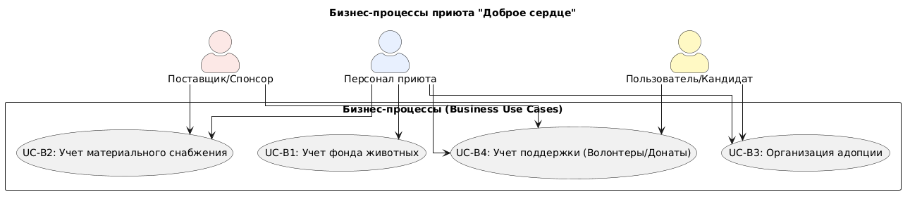
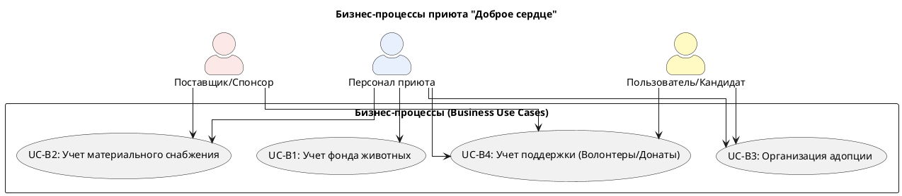

# Диаграмма бизнес-прецедентов (Business Use Case Diagram)

## Описание
Диаграмма отражает глобальные бизнес-цели организации «Доброе сердце», которые автоматизируются разрабатываемой программной системой. Моделирование бизнес-процессов позволяет выявить границы будущей автоматизации и роль каждого участника.

## Визуализация диаграммы

## Код модели (PlantUML)

## Основные бизнес-процессы (Business Use Cases)
1. **UC-B1: Учет фонда животных.** Процесс регистрации поступивших бездомных животных, ведение их медицинских и персональных карточек, отслеживание текущего статуса (на карантине, готов к адопции, усыновлен).
2. **UC-B2: Учет материального снабжения.** Процесс контроля остатков кормов, медикаментов и хозяйственных товаров на складах приюта для своевременного формирования заказов поставщикам и спонсорам.
3. **UC-B3: Организация процесса адопции.** Обработка обращений граждан, желающих забрать питомца, проведение проверок условий проживания и фиксация факта передачи животного новому владельцу.
3. **UC-B4: Учет поддержки (Волонтеры/Донаты).** Регистрация анкет волонтеров и учет благотворительных финансовых пожертвований.