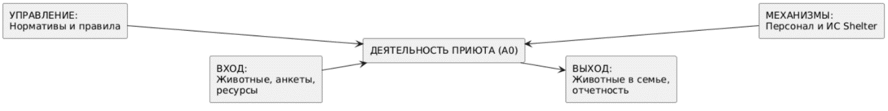
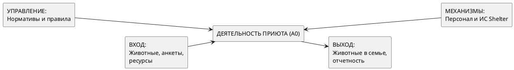

# Контекстная диаграмма системы (Context Diagram / IDEF0)

## Описание
Контекстная диаграмма определяет границы информационной системы приюта «Доброе сердце», идентифицируя внешние сущности и функциональные потоки. Моделирование выполнено в соответствии с методологией структурного анализа IDEF0 (уровень А0).

## Визуализация диаграммы

## Код модели (PlantUML)
Для генерации визуализации модели используется следующая спецификация:

## Потоки данных и сущности
1. **Входные потоки (Input)**
   * *Запросы пользователей:* Анкетные данные, заявки на адопцию, запросы на регистрацию в качестве волонтера.
   * *Объекты учета:* Информация о поступивших в приют животных, данные об изменении складских запасов (поступление/списание).

2. **Выходные потоки (Output)**
   * *Результаты обработки:* Статус заявки (Одобрено/Отклонено), актуальный каталог питомцев, сформированные отчеты для руководства.

3. **Управляющие воздействия (Control)**
   * *Нормативные требования:* Устав приюта, санитарные правила содержания животных, регламенты обработки персональных данных (ФЗ-152).

4. **Механизмы реализации (Mechanism)**
   * *Технические средства:* Сервер приложений (Apache Tomcat 10), СУБД PostgreSQL, программный код системы (Spring Boot).
   * *Человеческие средства:* Персонал приюта (администраторы, волонтеры), осуществляющий взаимодействие с интерфейсом.
