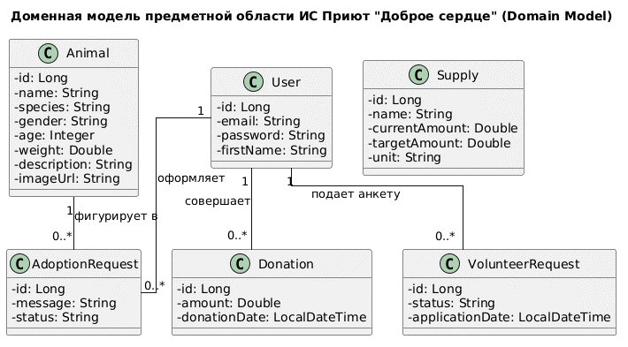
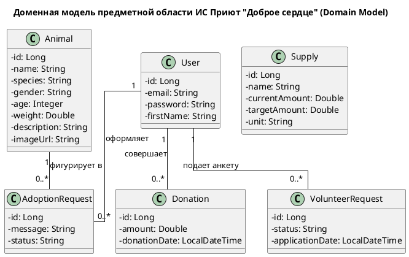

# Концептуальная доменная модель (Domain Model)

## Описание
Доменная модель представляет собой концептуальный каркас сущностей реального мира, их атрибутов и логических взаимосвязей, составляющих ядро бизнес-логики ИС приюта «Доброе сердце».

## Визуализация модели
Концептуальные классы и связи между ними:

## Код модели (PlantUML)

## Структурные элементы домена

1. **Сущность `User` (Пользователь):** Описывает аккаунты пользователей, включая администраторов и волонтеров.

2. **Сущность `Animal` (Питомец):** Центральный объект системы. Хранит детальную информацию о животном для каталога.

3. **Сущность `AdoptionRequest` (Заявка на усыновление):** Связующая сущность, фиксирующая связь между пользователем и выбранным питомцем.

4. **Сущность `Supply` (Материальный ресурс):** Объект учета складских запасов, необходимых для обеспечения нужд приюта.

5. **Сущность `Donation` (Пожертвование):** Финансовая сущность, отражающая вклад пользователя в деятельность организации.

6. **Сущность `VolunteerRequest` (Анкета волонтера):** Заявка пользователя на участие в волонтерской деятельности приюта.