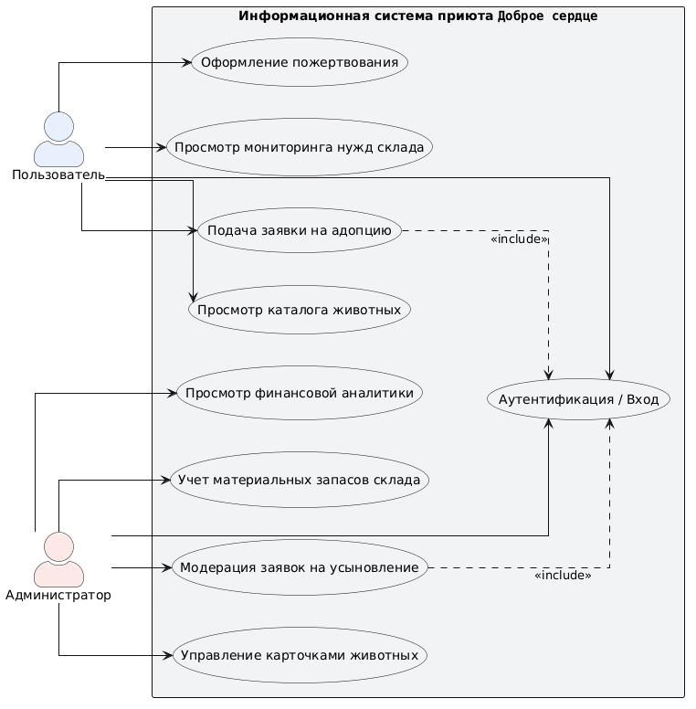
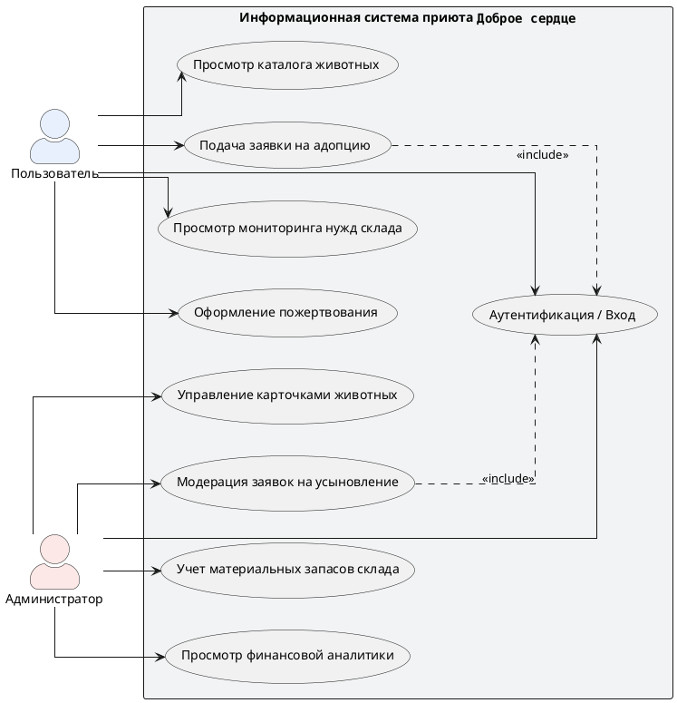

# Функциональная диаграмма прецедентов (Use Case Diagram)

## Описание
Диаграмма прецедентов визуализирует ожидаемое поведение информационной системы с точки зрения различных категорий пользователей (Акторов). Моделирование выполнено в нотации UML.

## Визуализация диаграммы
Ниже представлена функциональная схема системы:

## Код модели (PlantUML)

## Спецификация акторов
* **Пользователь (Гость / Потенциальный владелец):** Неавторизованный посетитель веб-интерфейса. Имеет доступ к чтению каталога животных, просмотру прогресс-баров склада и отправке асинхронных заявок.
* **Администратор (Волонтер / Сотрудник приюта):** Авторизованный пользователь с расширенными привилегиями. Осуществляет операционный учет фонда животных, управление заявками и инвентаризацию материальных ресурсов.

