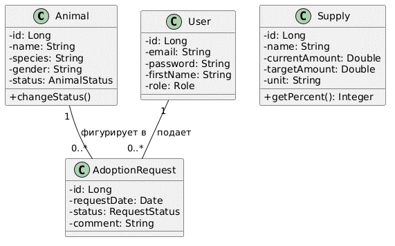

# Концептуальная доменная модель (Domain Model)

## Описание
Доменная модель представляет собой концептуальный каркас сущностей реального мира, их атрибутов и логических взаимосвязей, составляющих ядро бизнес-логики ИС приюта «Доброе сердце».

## Визуализация модели
Концептуальные классы и связи между ними (соответствует Рисунку 2.2 из пояснительной записки):

## Структурные элементы домена
1. **Сущность `User` (Пользователь):** Описывает волонтеров организации. Атрибуты: логин, email, хэш пароля, роль доступа.
2. **Сущность `Animal` (Питомец):** Центральный элемент учета. Содержит кличку, возраст, биологический вид, текстовое описание и статус нахождения в приюте.
3. **Сущность `Supply` (Материальный ресурс):** Описывает единицу складского учета (корма, медикаменты). Хранит текущий объем и максимальную емкость для расчета эффективности обеспечения.
4. **Сущность `AdoptionRequest` (Заявка на адопцию):** Связующая сущность, фиксирующая намерение человека усыновить конкретное животное (`Animal`).