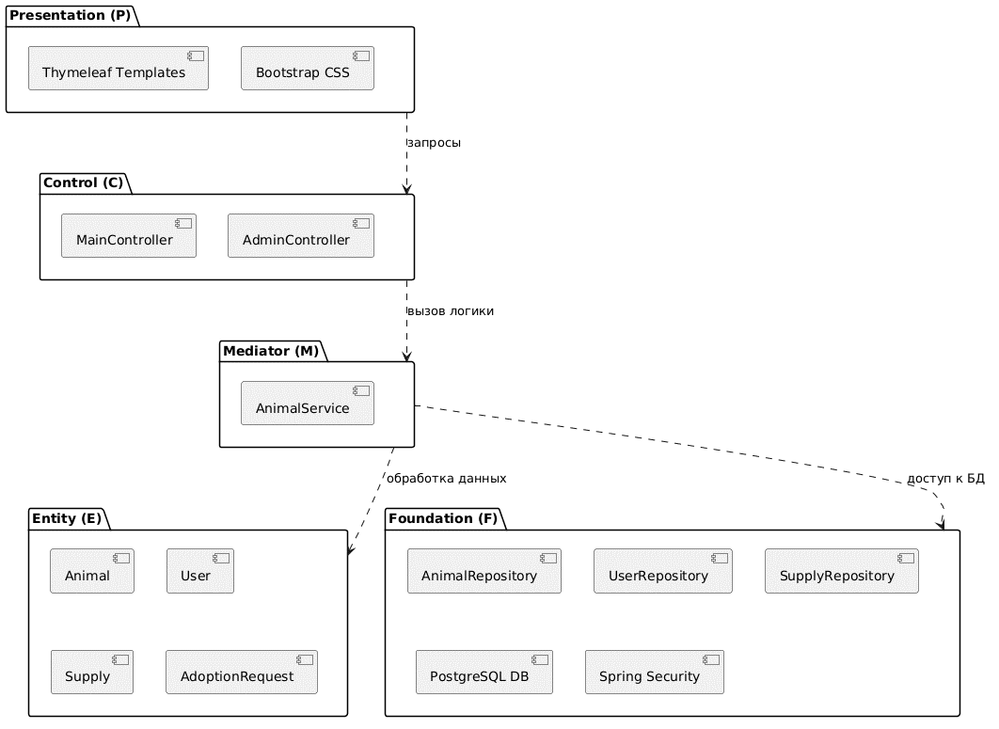

# Архитектурная диаграмма слоев PCMEF (Logical Component Diagram)

## Описание
Диаграмма отображает статическую структуру распределения классов по слоям паттерна PCMEF и направленность векторов зависимостей. Ключевое правило архитектуры: верхние слои могут зависеть от нижних, но нижние слои никогда не должны знать о существовании верхних.

## Визуализация диаграммы
Компонентная декомпозиция архитектуры (соответствует Рисунку 2.3 из пояснительной записки):

## Спецификация слоев приложения
1. **Presentation Layer (Слой представления):** Динамические XHTML-шаблоны Thymeleaf (`index.html`, `catalog.html`), CSS-стили Bootstrap 5 и клиентские скрипты на языке JavaScript для обработки асинхронных AJAX-запросов.
2. **Control Layer (Слой контроллеров):** Веб-контроллеры Spring MVC (`MainController`), выполняющие маршрутизацию HTTP-запросов (`GET/POST`), диспетчеризацию потоков управления и первичную валидацию веб-форм.
3. **Mediator Layer / Service Layer (Слой бизнес-логики):** Транзакционные сервисы (`AnimalService`, `SupplyService`, `AdoptionRequestService`), инкапсулирующие ключевые алгоритмы, бизнес-правила приюта и вычисляемые параметры.
4. **Entity Layer (Слой доменных сущностей):** ORM-модели данных (`Animal`, `User`, `Supply`, `AdoptionRequest`), размеченные JPA-аннотациями для автоматического отображения на таблицы БД.
5. **Foundation Layer (Базовый инфраструктурный слой):** Репозитории Spring Data JPA (`AnimalRepository`, `SupplyRepository`), обеспечивающие абстракцию над SQL-запросами, и конфигурационные классы системы (настройки пула HikariCP).