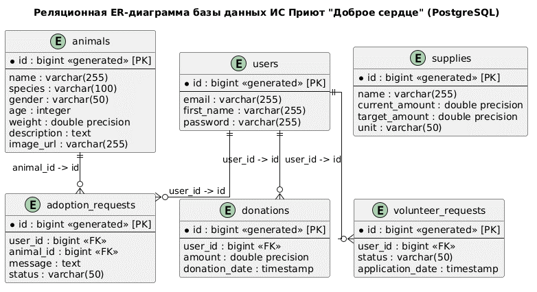
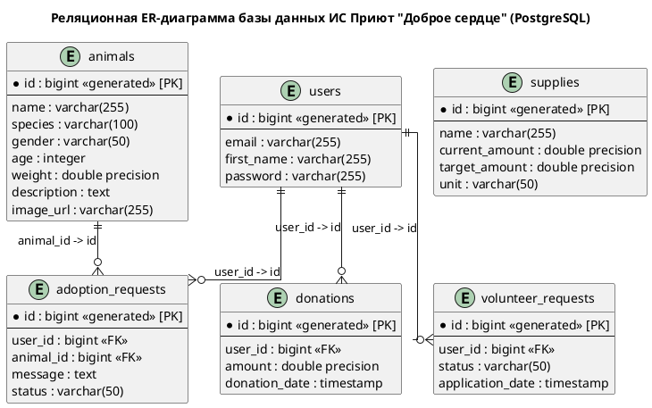

# Диаграмма сущностей и связей (Entity-Relationship Diagram)

## Описание
ER-диаграмма отображает физическую структуру таблиц в СУБД PostgreSQL, типы данных колонок, обязательность заполнения полей (`NOT NULL`) и логические связи между таблицами (один-ко-многим). Моделирование выполнено в нотации Crow's Foot («Птичья лапка»).

## Визуализация диаграммы

## Исходный код (PlantUML):

## Описание реляционных связей
* **`users` (Пользователи):** Центральная таблица, связывающая персонал и волонтеров с их активностями (заявками на адопцию, пожертвованиями и заявками на волонтерство).
* **`animals` ───< `adoption_requests` (Один-ко-многим):** Одно животное может фигурировать в нескольких заявках. Реализовано через внешний ключ `animal_id`.
* **`supplies` (Склад):** Учет ресурсов приюта.
* **`donations` (Пожертвования):** Хранит историю финансовых взносов от пользователей.
* **`volunteer_requests` (Заявки волонтеров):** Хранит статус рассмотрения заявок от кандидатов в волонтеры.