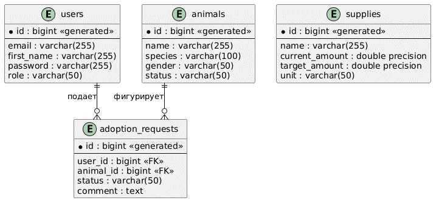

# Диаграмма сущностей и связей (Entity-Relationship Diagram)

## Описание
ER-диаграмма отображает физическую структуру таблиц в СУБД PostgreSQL, типы данных колонок, обязательность заполнения полей (`NOT NULL`) и логические связи между таблицами (один-ко-многим). Моделирование выполнено в нотации Crow's Foot («Птичья лапка»).

## Визуализация диаграммы
Ниже представлена реляционная структура базы данных приюта (соответствует Рисунку 2.4 из пояснительной записки):

## Описание реляционных связей
* **`users` (Пользователи):** Изолированная таблица для учета волонтерского персонала и администраторов системы.
* **`animals` ───< `adoption_requests` (Один-ко-многим):** Одно животное может фигурировать в нескольких заявках на усыновление. Связь реализована через внешний ключ `animal_id` в таблице заявок. При удалении записи животного из базы, все связанные с ним заявки автоматически каскадно удаляются (`ON DELETE CASCADE`).
* **`supplies` (Материальное обеспечение):** Таблица складского учета ресурсов, содержащая поля текущего количества и максимальной вместимости ячейки для расчета заполненности в интерфейсе.