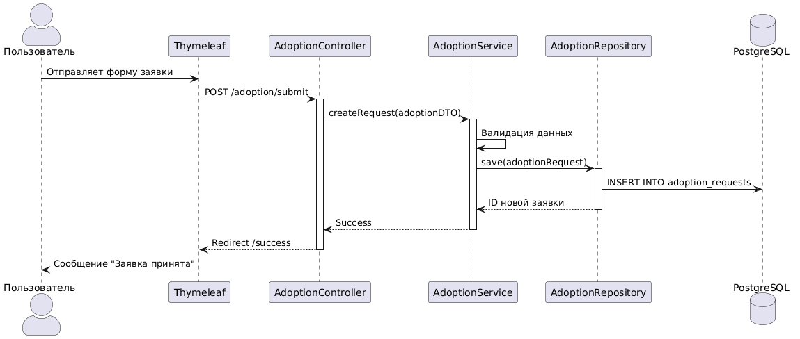
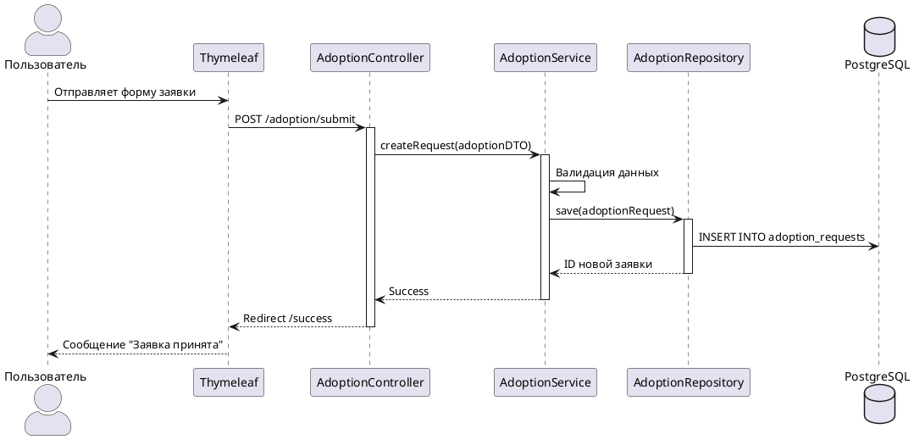
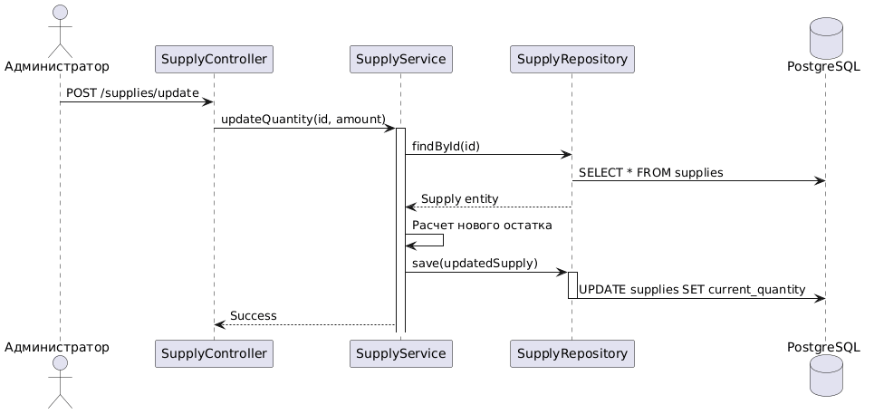
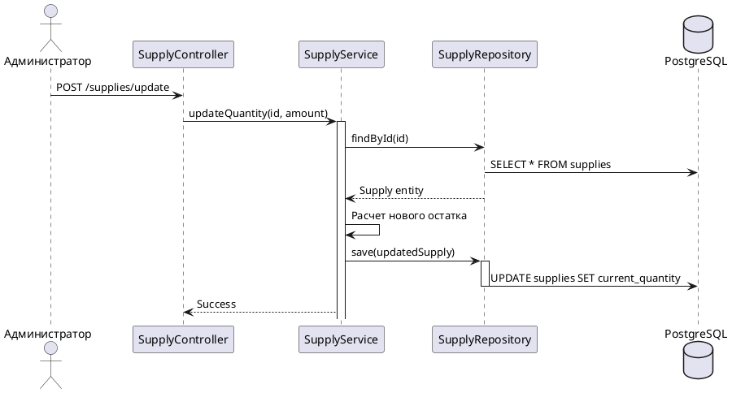

# Диаграммы последовательности (UML Sequence Diagrams)

## Описание
Диаграмма последовательности отражает детальный алгоритм обработки запроса волонтера на изменение объемов материально-технического обеспечения склада приюта. Схема наглядно иллюстрирует, как вызов проходит сквозь сквозные слои архитектуры PCMEF.

## 1. Сценарий: Оформление заявки на адопцию
Этот процесс демонстрирует прохождение данных от пользовательского интерфейса до фиксации в базе данных.

### Описание шагов:
1. **View ──> Controller:** Пользователь отправляет данные формы (имя, телефон, ID животного). Контроллер получает `AdoptionDTO`.
2. **Controller ──> Service:** Контроллер вызывает метод `createRequest`. Это обеспечивает изоляцию веб-слоя от бизнес-логики.
3. **Service ──> Service:** Слой сервиса выполняет бизнес-валидацию (например, проверяет, доступно ли животное для адопции).
4. **Service ──> Repository:** Сервис формирует объект сущности `AdoptionRequest` и передает его в репозиторий.
5. **Repository ──> DB:** Выполняется SQL-команда `INSERT`.
6. **Result:** Результат возвращается обратно по цепочке, после чего контроллер перенаправляет пользователя на страницу успеха.

## Визуализация динамики взаимодействия

## PlantUML

## 2. Сценарий: Обновление запасов на складе
Показывает работу администратора с ресурсами приюта.

### Описание шагов:
1. **Admin ──> Controller:** Администратор отправляет запрос на изменение количества товара.
2. **Controller ──> Service:** Передача идентификатора товара и нового значения в `SupplyService`.
3. **Service ──> Repository:** Сервис запрашивает текущее состояние объекта из базы (`SELECT`).
4. **Service ──> Service:** Вычисление нового значения остатка (бизнес-логика).
5. **Service ──> Repository:** Сохранение обновленного объекта в БД (`UPDATE`).
6. **Result:** Информирование контроллера об успешном завершении операции.

## Визуализация динамики взаимодействия

## PlantUML

---
*Диаграммы иллюстрируют строгое соблюдение паттерна PCMEF: контроллеры не работают с БД напрямую, вся логика инкапсулирована в сервисах.*
