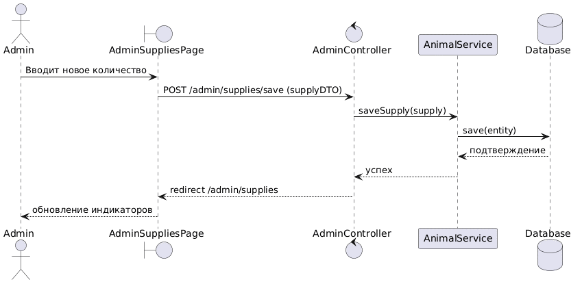

# Диаграммы последовательности (UML Sequence Diagrams)

## Описание
Диаграмма последовательности отражает детальный алгоритм обработки запроса волонтера на изменение объемов материально-технического обеспечения склада приюта. Схема наглядно иллюстрирует, как вызов проходит сквозь сквозные слои архитектуры PCMEF.

## Визуализация динамики взаимодействия
Процесс обновления данных снабжения (соответствует Рисунку 2.5 из пояснительной записки):

## Пошаговое описание жизненного цикла вызова (Trace Log)

1. **Инициация (Presentation -> Control):**
   * Администратор (Волонтер) вносит новое значение количества корма/медикаментов в веб-форму интерфейса и нажимает «Сохранить».
   * Слой представления (Thymeleaf/Bootstrap) генерирует HTTP-запрос `POST /supplies/update` и перенаправляет его в контроллер бэкенда.

2. **Обработка и перенаправление (Control -> Mediator):**
   * `MainController` (слой Control) перехватывает запрос, извлекает параметры формы и делегирует их обработку методу `updateQuantity(...)` сервисного слоя `SupplyService` (слой Mediator).

3. **Бизнес-логика и вычисления (Mediator -> Entity -> Foundation):**
   * `SupplyService` извлекает текущий персистентный объект ресурса из базы данных, используя репозиторий `SupplyRepository` (слой Foundation).
   * Сервис обращается к доменной сущности `Supply` (слой Entity) для выполнения инкапсулированного метода пересчета `getPercent()`, который обновляет состояние заполненности шкалы Progress Bar.

4. **Персистенция и сохранение (Foundation -> СУБД):**
   * Обновленная сущность передается обратно в `SupplyRepository`, который выполняет команду `save()`.
   * Пул соединений HikariCP передает транзакционный SQL-запрос `UPDATE supplies ...` в СУБД PostgreSQL 17.

5. **Обратная связь (Возврат ответа):**
   * База данных подтверждает транзакцию. Контроллер перенаправляет пользователя на обновленный дашборд склада, где компонент Progress Bar визуализирует новые показатели снабжения.