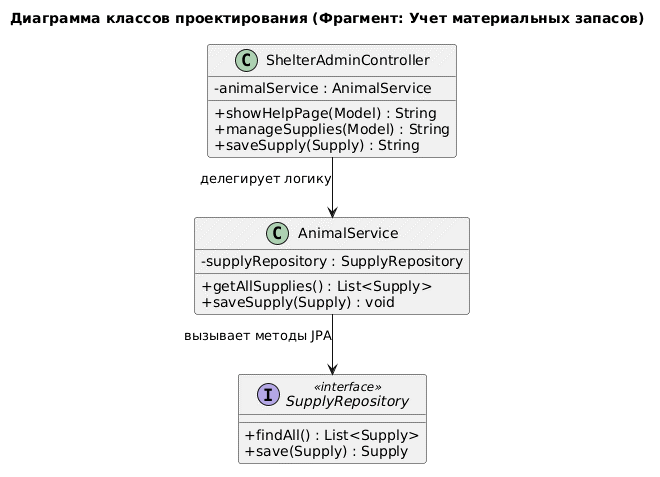
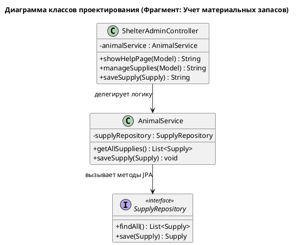

# Диаграмма классов проектирования (Class Diagram)

Данная диаграмма демонстрирует взаимодействие между компонентами системы на примере модуля учета материальных запасов. Она отражает реализацию паттерна PCMEF и принципа инверсии управления (IoC).

## Визуализация
\

## PlantUML

## Описание связей
* **ShelterAdminController ──> AnimalService:** Контроллер не создает сервис самостоятельно, он получает его через конструктор (Dependency Injection), что позволяет легко подменять реализацию (например, для тестирования).
* **AnimalService ──> SupplyRepository:** Слой сервиса обращается к данным через интерфейс репозитория, скрывая детали реализации запросов к БД.
* **Свойства:** * `-` (private): Инкапсуляция полей зависимостей.
  * `+` (public): Публичный контракт методов контроллера и сервиса.

---
*Диаграмма подтверждает соблюдение принципа слабой связанности (Loose Coupling): компоненты взаимодействуют через интерфейсы и абстракции, а не через прямые экземпляры классов.*