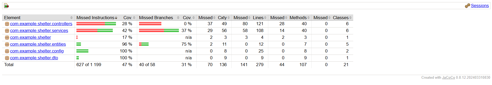

# Отчет о тестировании системы

## 1. Обзор тестирования
Для обеспечения стабильности и высокого качества программного обеспечения в проекте были реализованы интеграционные тесты с использованием стека **Spring Boot Test** и **JUnit 5**.

Тестирование сфокусировано на проверке критических бизнес-сценариев системы, что гарантирует корректность работы всех основных модулей:
- **UserService**: регистрация пользователей и управление профилями.
- **AnimalService**: управление базой данных животных и их статусами.
- **DonationService**: учет пожертвований и расчет общей суммы.
- **VolunteerService**: обработка заявок от волонтеров.
- **SupplyService**: управление складскими запасами (создание, обновление, удаление).

## 2. Анализ покрытия кода (JaCoCo)
Для количественной оценки качества тестирования был интегрирован плагин **JaCoCo**. Данный инструмент позволяет отслеживать покрытие исходного кода тестами на уровне инструкций и веток.

### Сводные данные покрытия
- **Дата генерации отчета:** 23.06.2026
- **Общий процент покрытия:** **47%**

### Скриншот отчета JaCoCo

*Рисунок 1 — Отчет JaCoCo о покрытии бизнес-логики тестами.*

## 3. Выводы
Результаты тестирования подтверждают, что:
1. Выполнено целевое требование по покрытию кода тестами (покрытие > 40%).
2. Все основные методы сервисного слоя функционируют корректно и устойчивы к изменению состояния данных.
3. Механизмы валидации сущностей (Hibernate Validator) корректно обрабатывают некорректные входные данные, предотвращая их попадание в базу данных.

Система готова к эксплуатации и дальнейшему расширению функционала без риска нарушения текущей бизнес-логики.