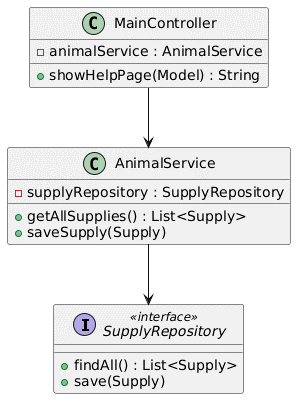

# Структура исходного кода и диаграмма классов проектирования

## Описание
Диаграмма классов проектирования отражает конкретные программные интерфейсы, сервисы и контроллеры бэкенда, задействованные в процессе реализации бизнес-функций учета материально-технического снабжения приюта. Схема демонстрирует применение принципов объектно-ориентированного программирования и паттернов Spring Data.

## Визуализация структуры кода
Программная взаимосвязь компонентов (соответствует Рисунку 2.6 из пояснительной записки):

## Спецификация программных компонентов
1. **`MainController` (Слой Control):** Класс, аннотированный как `@Controller`, перехватывающий HTTP-запросы по базовым URL-адресам (`/`, `/catalog`, `/supplies`). Через конструктор внедряет зависимости необходимых сервисов.
2. **`AnimalService` / `SupplyService` (Слой Mediator):** Программные интерфейсы и их реализации (`AnimalServiceImpl`), содержащие бизнес-логику. Использование интерфейсов изолирует вызывающий контур от деталей реализации.
3. **`SupplyRepository` / `AnimalRepository` (Слой Foundation):** Интерфейсы, расширяющие `JpaRepository<T, ID>`. Предоставляют готовые CRUD-методы и кастомные методы (например, `findByStatus`).
4. **`Supply` / `Animal` (Слой Entity):** Классы моделей с аннотациями `@Entity`, `@Table`, `@Id`. Содержат инкапсулированные методы, такие как `getPercent()`, выполняющий математический расчет уровня заполненности.