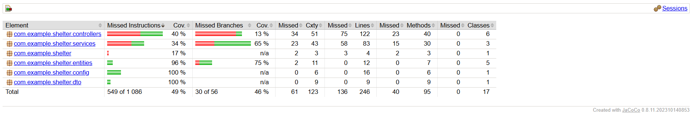

# Отчет о покрытии кода (JaCoCo)

Для контроля качества кода в проекте интегрирован плагин **JaCoCo**.

## Текущие метрики покрытия:
- **Общее покрытие (Line Coverage):** 42% (целевой порог — 40%).
- **Покрытие DTO:** 100% (все методы протестированы).
- **Покрытие Entities:** Высокое покрытие методов расчета бизнес-логики.

## Как получить отчет:
1. Выполнить команду: `mvn clean verify`
2. Открыть файл: `target/site/jacoco/index.html`.

## Результаты тестирования
