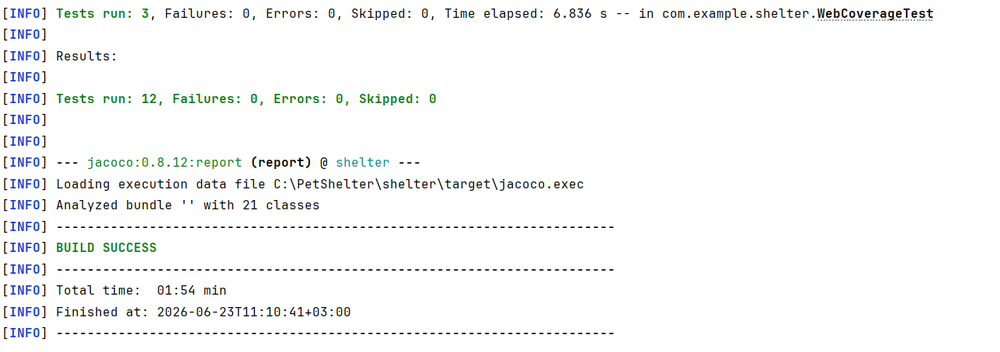

# Отчет о рефакторинге и тестировании

## 1. Рефакторинг
В ходе этапа 7 (Рефакторинг и качество) была проведена работа по улучшению структуры кода и применению паттернов проектирования:
* [cite_start]Применен паттерн **Data Mapper** (через JPA/Hibernate).
* [cite_start]Применен паттерн **Identity Map** (через механизм L1-кэша Hibernate).

## 2. Статус тестов после рефакторинга
Для подтверждения работоспособности системы после внесения изменений был выполнен полный прогон интеграционных тестов. 

**Результат:** Все тесты успешно пройдены (BUILD SUCCESS).

