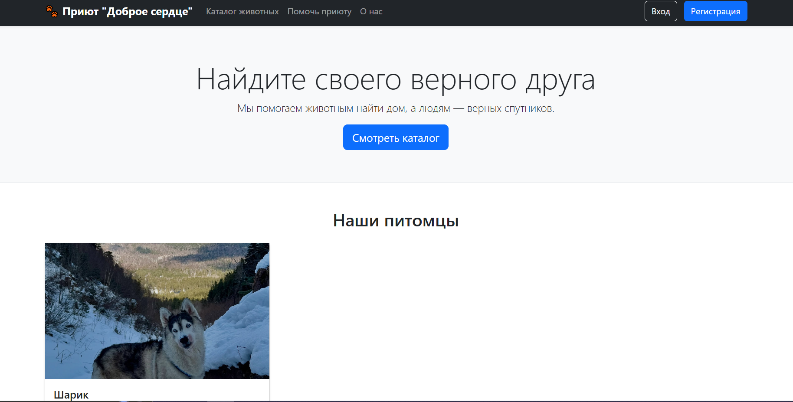
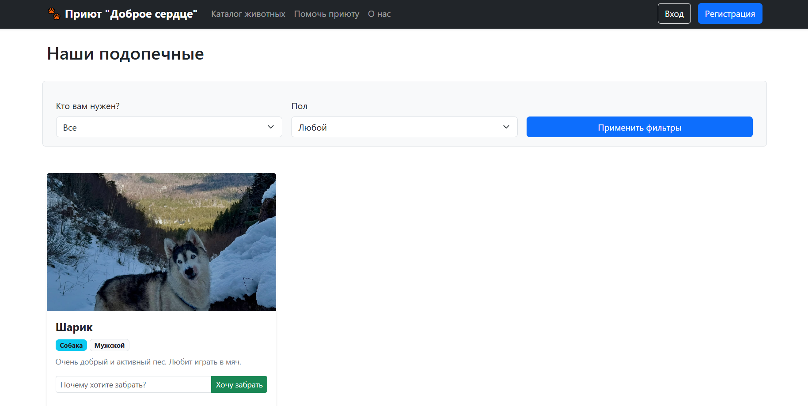
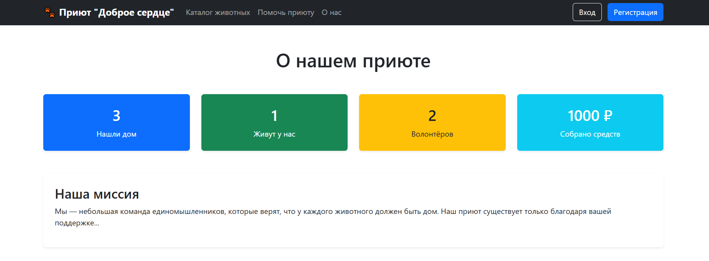
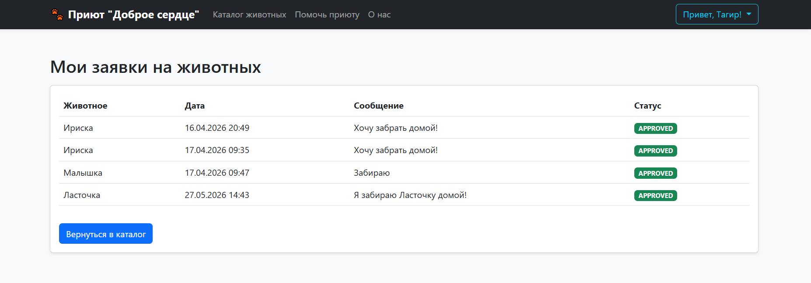
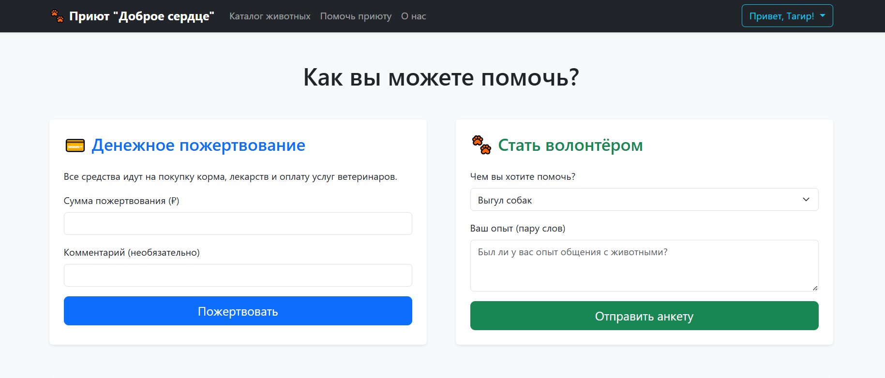
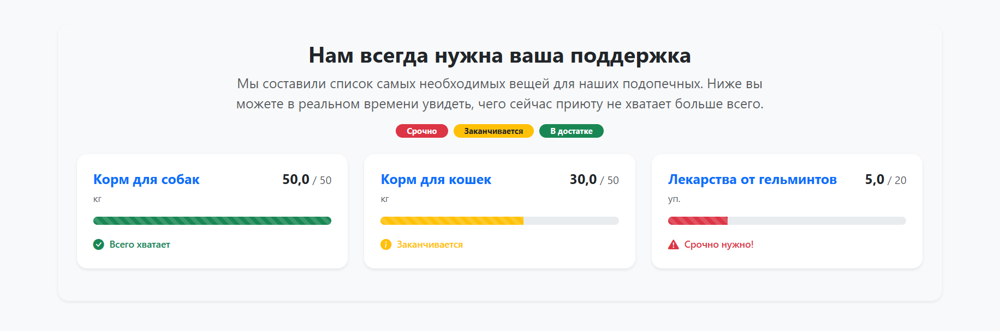

# Галерея экранных форм веб-приложения (UI Screenshots)

## Описание
В данном документе представлены скриншоты и подробное описание архитектуры всех экранных форм разработанной информационной системы приюта «Доброе сердце». Интерфейс разработан с использованием фреймворка Bootstrap 5, что гарантирует удобство работы как администраторов, так и гостей приюта.

---

## 1. Главная страница (Дашборд и материальное обеспечение)
Центральный хаб приложения, предназначенный для быстрой оценки состояния ресурсов приюта.

### Визуализация

### Элементы интерфейса:
* **Информационные карточки (Cards):** Верхние блоки с экспресс-статистикой (общее число животных, количество свободных вольеров, активные заявки).
* **Интерактивный Progress Bar:** Динамический компонент склада снабжения. Наглядно показывает уровень заполненности ячеек корма и медикаментов в процентах, меняя цвет в зависимости от критичности остатка (`bg-danger` при дефиците, `bg-success` при норме).

---

## 2. Каталог питомцев и форма подачи заявки (Адопция)
Страница со списком всех подопечных приюта, доступных для усыновления.

### Визуализация

### Функциональные элементы:
* **Сетка карточек (Grid System):** Каждое животное представлено отдельным адаптивным блоком с фотографией, кличкой, возрастом и статусом (`Свободен`, `На испытательном сроке`).
* **Модальное окно «Забрать домой»:** Всплывающая форма для отправки AJAX-заявки. Волонтеры получают асинхронный запрос мгновенно, а пользователь видит сообщение об успешной отправке без перезагрузки всей страницы.

---

## 3. Страница «О нас» (Информационный блок)
Статично-презентационная страница, раскрывающая миссию волонтерского движения и правила приюта.

### Визуализация

### Элементы интерфейса:
* **Компонент Accordion (Спойлеры):** Используется для компактного размещения ответов на часто задаваемые вопросы (FAQ): «Как стать волонтером?», «Какие документы нужны для адопции?».
* **Блок контактов:** Интегрированная карта проезда к приюту, адрес, телефон и график работы приемных часов.

---

## 4. Страница «Профиль пользователя» (Личный кабинет волонтера)
Персонализированное рабочее пространство авторизованного сотрудника организации.

### Визуализация

### Элементы интерфейса:
* **Карточка профиля (User Card):** Отображает аватар волонтера, его ФИО, контактные данные и роль в системе (`ROLE_ADMIN` или `ROLE_VOLUNTEER`).
* **Таблица персональной активности:** Список последних измененных данным волонтером карточек животных или обновленных записей склада для обеспечения прозрачности учета.

---

## 5. Страница «Помощь» (Раздел поддержки и краудфандинга)
Интерфейс для сбора пожертвований и публикации списков экстренных нужд приюта.

### Визуализация

### Элементы интерфейса:
* **Список нужд (To-Do List):** Актуальный перечень вещей, в которых приют нуждается прямо сейчас (например: «Одеяла», «Пеленки», «Шприцы»).
* **Форма реквизитов:** Выделенный визуальный блок (Alert/Well) с банковскими реквизитами приюта и кнопками быстрой скопировать данные для перевода материальной помощи.