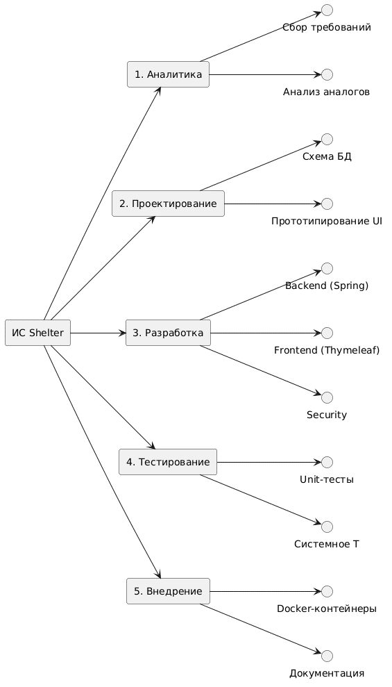

# Этап 8: Итоговая отчетность, эксплуатационная документация и управление проектом

## Описание этапа
Заключительный этап жизненного цикла разработки информационной системы приюта «Доброе сердце». На данном этапе выполнено обобщение проектных артефактов, сформировано формальное техническое задание, составлены детальные руководства для операторов (волонтеров) и системных администраторов, а также консолидированы метрики планирования, календарного графика и расчета стоимости разработки.

## Содержимое каталога
* [technical-specification.md](technical-specification.md) — Техническое задание (ТЗ) на разработку по ГОСТ-ориентированной структуре.
* [user-guide.md](user-guide.md) — Руководство пользователя (инструкция по работе с интерфейсом для гостей и волонтеров).
* [admin-guide.md](admin-guide.md) — Руководство системного администратора (инструкция по развертыванию WAR на Apache Tomcat 10.1 и конфигурации PostgreSQL).
* `presentation.pptx` — Презентация проекта для защиты перед аттестационной комиссией.

## Планирование и экономика проекта
Ниже представлены ключевые метрики планирования проекта (соответствуют материалам Раздела 6 пояснительной записки):

### 1. Иерархическая структура работ (WBS)
Для декомпозиции задач проекта была построена древовидная структура WBS:

### 2. График разработки (Диаграмма Ганта)
Календарное планирование и распределение задач по неделям:

### 3. Оценка трудозатрат по модели COCOMO II
На основе объема исходного кода приложения (около 2.5 KLOC) по алгоритмической модели COCOMO II (модель раннего проектирования) получены следующие показатели:
* **Трудоемкость (Effort):** ~7.8 человеко-месяцев.
* **Сроки разработки (Time to Development):** ~5.4 месяцев.
* **Рекомендуемый состав команды:** 1-2 инженера.